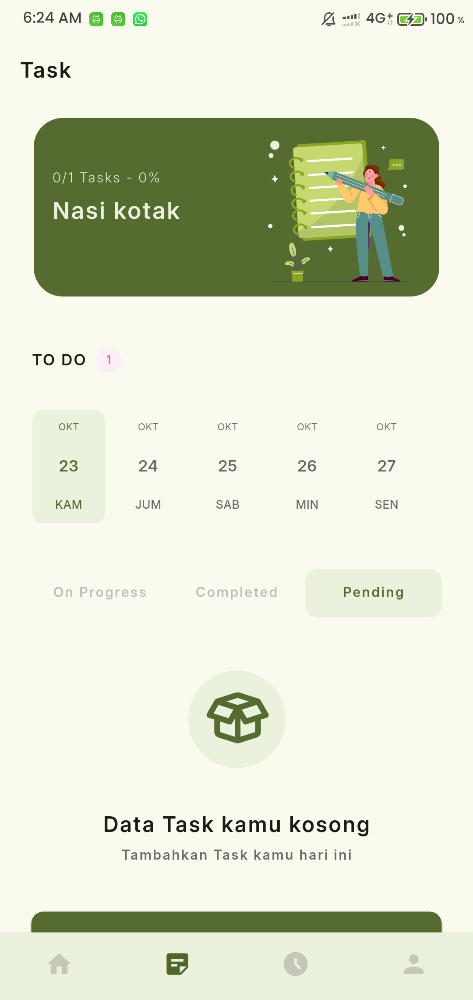
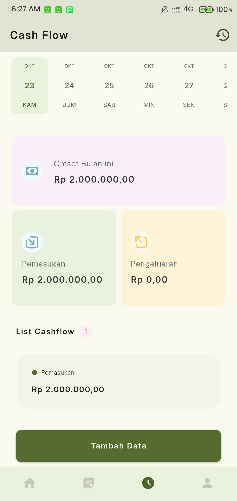

p# RencanaKu Apps

## Capstone Project - B25-PG011

## Deskripsi Umum

RencanaKu merupakan aplikasi tracking planning dan cashflow yang dirancang untuk membantu pelaku UMKM agar lebih terarah dalam menjalankan bisnisnya.
Aplikasi ini membantu pengguna untuk:

📋 Merencanakan kegiatan atau target bisnis<br>
💰 Melacak pemasukan dan pengeluaran harian<br>
📊 Memantau perkembangan keuangan secara berkala

Proyek ini dikembangkan sebagai bagian dari Capstone Project pada program Bootcamp BEKUP Create: Upskilling Skills 2025.

## Tujuan Aplikasi

- Membantu UMKM dalam perencanaan bisnis dan keuangan.
- Memberikan insight sederhana namun efektif mengenai kondisi cashflow.
- Menjadi contoh penerapan Flutter + Firebase dalam pengembangan aplikasi modern.

## Teknologi yang Digunakan

| Kategori           | Teknologi                                                                                     |
| ------------------ | --------------------------------------------------------------------------------------------- |
| Framework          | Flutter                                                                                       |
| Bahasa Pemrograman | Dart                                                                                          |
| Backend            | Firebase (Firestore, Authentication, Cloud Messaging, Crashlytics), Cloudinary (upload photo) |
| State Management   | Provider                                                                                      |
| Tools              | Android Studio, VS Code, Figma, GitHub, Trello                                                |

## Packages yang Digunakan  

- [`http`](https://pub.dev/packages/http) → Mengambil data dari Dicoding Restaurant API.  
- [`provider`](https://pub.dev/packages/provider) → State management untuk mengatur data & UI.  
- [`shared_preferences`](https://pub.dev/packages/shared_preferences) → Berguna untuk caching data personal pengguna. 
- [`flutter_timezone`](https://pub.dev/packages/flutter_timezone) → Menentukan setup zona waktu untuk notifikasi agar sesuai dengan perangkat pengguna. 
- [`flutter_local_notifications`](https://pub.dev/packages/flutter_local_notifications) → Menampilkan notifikasi dari firebase cloud messaging.
- [`firebase_core`](https://pub.dev/packages/firebase_core) → Paket utama untuk menginisialisasi Firebase di aplikasi Flutter.
- [`firebase_auth`](https://pub.dev/packages/firebase_auth) → Menangani proses autentikasi pengguna (login, register, logout).
- [`cloud_firestore`](https://pub.dev/packages/cloud_firestore) → Menyimpan dan mengambil data dari Cloud Firestore secara realtime.
- [`firebase_messaging`](https://pub.dev/packages/firebase_messaging) → Mengatur dan menerima push notification dari FCM (Firebase Cloud Messaging).
- [`firebase_crashlytics`](https://pub.dev/packages/firebase_crashlytics) → Mencatat dan melaporkan error atau crash yang terjadi di aplikasi untuk analisis developer.
- [`date_picker_timeline`](https://pub.dev/packages/date_picker_timeline) → Menampilkan timeline tanggal interaktif, berguna untuk memilih dan menavigasi tanggal pada rencana kegiatan.
- [`image_picker`](https://pub.dev/packages/image_picker) → Mengambil gambar dari galeri atau kamera untuk kebutuhan upload foto profil.
- [`camera`](https://pub.dev/packages/camera) → Mengakses fitur kamera perangkat secara langsung untuk mengambil foto di dalam aplikasi.
- [`flutter_dotenv`](https://pub.dev/packages/flutter_dotenv) → Mengelola file `.env` untuk menyimpan konfigurasi rahasia seperti API key atau Cloudinary credentials.
- [`mockito`](https://pub.dev/packages/mockito) → Membuat mock object untuk kebutuhan unit testing, agar logika aplikasi dapat diuji tanpa bergantung pada data asli.

## Fitur Utama

✅ Autentikasi Pengguna (Login / Register)<br>
Akses aplikasi dengan akun pribadi untuk menjaga keamanan dan privasi data.

👤 Profil Pengguna<br>
Ubah dan kelola informasi akun sesuai kebutuhan bisnis.

📅 Rencana Kegiatan Bisnis<br>
Buat, pantau, dan atur jadwal kegiatan harian maupun mingguan agar bisnis tetap terarah.

💵 Pencatatan Pemasukan dan Pengeluaran<br>
Catat transaksi keuangan dengan mudah untuk memantau arus kas bisnis.

🔔 Notifikasi<br>
Dapatkan pengingat otomatis terkait aktivitas penting dan kampanye bisnis yang sedang berlangsung.

📊 Dashboard Pengguna<br>
Lihat ringkasan kegiatan bisnis serta laporan cashflow mingguan dalam tampilan dashboard yang informatif.

## Screenshoots

<p align="center">
  
  
</p>
<p align="center">
  
  

  
</p>
<p align="center">

  
  
</p>
<p align="center">

  
  
  
  
  
  
  
</p>
<p align="center">


  
  
</p>
<p align="center">


  
  
</p>

## Tim Pengembang

### Kelompok B25-PG011<br>

Program Bootcamp BEKUP Create: Upskilling Skills 2025

| No       | Nama                     | Peran                               |
| -------- | ------------------------ | ----------------------------------- |
| BC25B035 | Bayu Teguh Pamuji        | Project Manager / Flutter Developer |
| BC25B031 | Martaulina Simanungkalit | UI/UX Designer / QA Tester          |
| BC25B019 | Diaz Saputra             | Frontend Developer                  |
| BC25B037 | Mirza Danish Faturrahman | Backend Developer                   |

## Cara Menjalankan Aplikasi

1. Clone repository ini:

   ```bash
   git clone https://github.com/bayutp/b25_pg011_capstone_project.git
   cd b25_pg011_capstone_project
   ```

2. **Install dependency Flutter**

   ```bash
   flutter pub get
   ```

3. **Jalankan aplikasi di emulator atau perangkat fisik**

   Sebelum menjalankan aplikasi, pastikan:

   - Sudah menghubungkan proyek dengan Firebase
   - File konfigurasi Firebase (`google-services.json` untuk Android atau `GoogleService-Info.plist` untuk iOS) sudah ditempatkan di folder yang sesuai:
     - Development: `android/app/dev/`
     - Production: `android/app/prod/`
   - File `firebase_options.dart` sudah dibuat untuk masing-masing flavor
   - File `.env` pada root project untuk menyimpan key **Cloudinary** agar fitur upload photo

     ```bash
     CLOUDINARY_CLOUD_NAME=<nama project cloudinary>
     CLOUDINARY_UPLOAD_PRESET=<nama preset cloudinary>
     Cara menjalankan aplikasi:

     ```

   - Mode Development:

     ```bash
     flutter run -t lib/main_dev.dart --flavor dev
     ```

   - Mode Production:
     ```bash
     flutter run -t lib/main_prod.dart --flavor prod
     ```

## Lisensi

Proyek ini dikembangkan untuk tujuan edukasi dan non-komersial.

© 2025 Kelompok B25_PG011 — All rights reserved.
